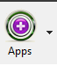
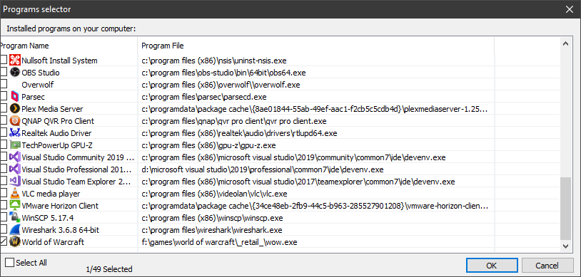
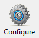
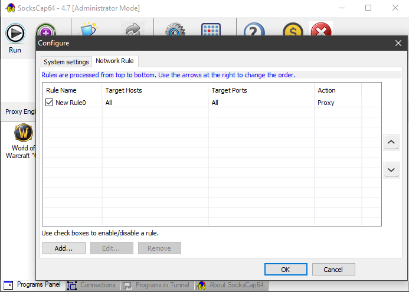
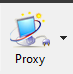
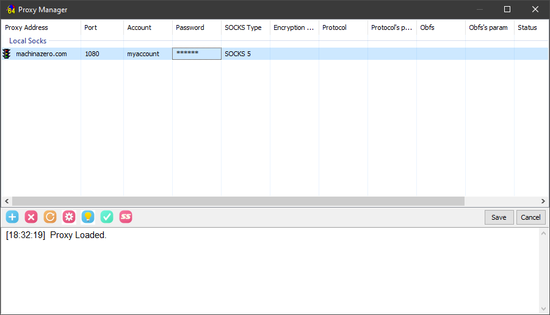

# Jehebus's WoW Proxy Server (MachinaZero)

1. Download and Install Sockscap64 - https://www.sockscap64.com/homepage/

    Direct links:
    - https://www.mediafire.com/folder/32rj1769a2w82/v4.7
    - https://mega.nz/#F!qBoD2BiB!BZbHB1tetB79SAvJEoVlLw
    - https://www.dropbox.com/sh/yf88deqbe3m1xng/AAAiaAg6FR1uKtnBpcH5Gzv5a?dl=0
2. [No] you don't want it to add your web browser, [Agree] to the terms
3. Click , find World of Warcraft in the list, tick it then click OK

   
5. Click , then go to the Network Rule tab
6. Click Add then click OK (all the boxes can remain blank)

   If it looks like this, hit OK again
   
   
   
6. We're done with setup, but Sockscap is in Administrator mode, we need it in Normal User mode.
   Click  (don't just close the window or it will just minimize to the tray)
7. Run SocksCap64(Normal User Mode)
8. [No] you don't want it to add your web browser
9. Click 
10. Click the blue + on the left
11. Click in the list where it says Click to Edit IP, and enter machinazero.com
12. Click in the Account and Password boxes, entering your login details
    
14. Press Save
15. We're done! You can now run World of Warcraft via the icon inside SocksCap, and your connection will use the MachinaZero tunnel
